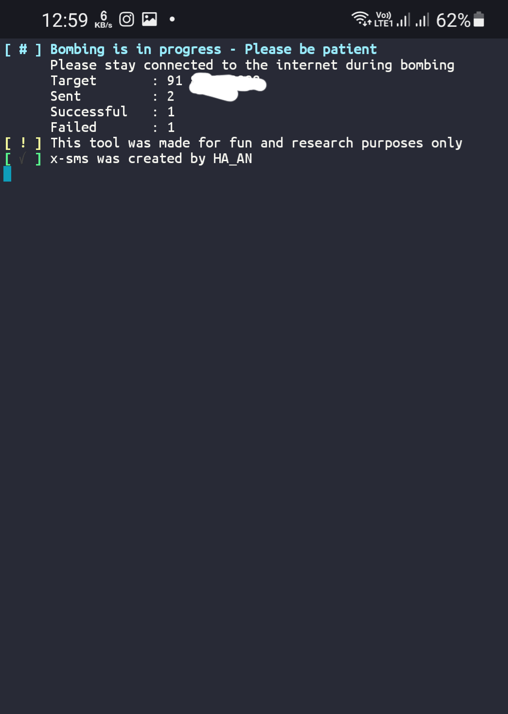
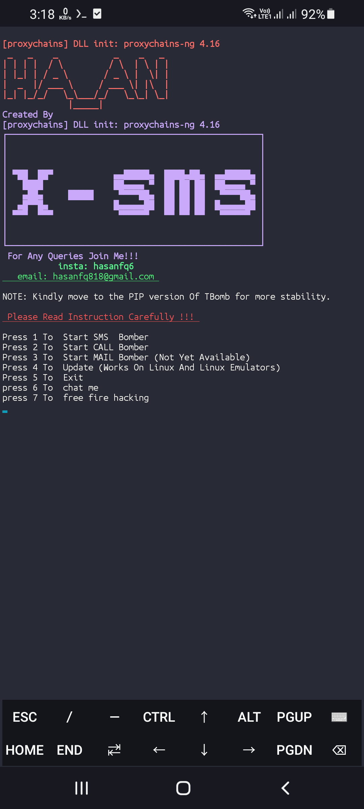
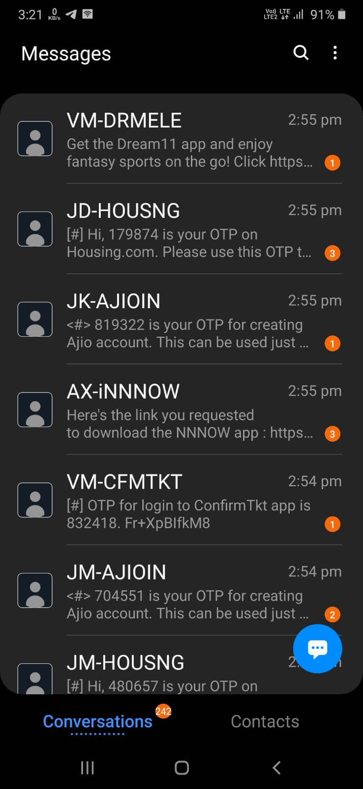

<a href="https://github.com/Kamanati/sms-anony">sms-anony</a>

<a href="https://instagram.com/hasanfq6?igshid=YmMyMTA2M2Y=" rel="nofollow"></a>

</p>

<p align="center">
  
  
  
  
  
</p>

<p align="center">


</p>

 ### screenshots 1
 
 #### screenshots 2
 
## Updates:
**v1.0**<br>
[+] Basic Features<br>
[+] Non-Colourful Interface.<br><br>
**v1.1**<br>
[+] Adding Colours.<br><br>
**v1.2**<br>
[+] Fixing Colour Issues<br>
[+] Adding Tracking Feature.<br><br>
**v1.3**<br>
[+] Adding Lolcat To Make More Colourful Start.<br><br>
**v1.4**<br>

## Note:

- The script requires working network connection to work.
- No balance will be deducted for using this script to send SMS.
- Don't put spaces in between phone number (Ex- 99999 99999)
- Make sure you are using the latest version of x-sms
- Make sure you are using shell

Here's how you can check it. Type this command in your terminal.
```
$ shell -V
```

- Do not use this to harm others.
- This script is only for educational purposes or to prank.
- **None of the developers/contributors are responsible for the misuse of x-sms.**
<br>

### Features:

- This Is A Free Version.
- Super-fast Mesage Sending.
- International Message Sending available.
- You Can Send Only 1,00,000 Message Per Day.
- Messaging unlimited 
- Easy to use and embed in code.

### Usage:

Run these commands to Send unlimited Message

### > For Termux:

**Notice:** 

git installation methods are not universal and do differ between distributions,
so, installing git as per instructions below may not work.
Please check out how to install `git` for your Linux distribution.
Commands below provide instructions for Debian-based systems.

To Send unlimited Message type the following commands in Termux:
```
pkg install git
pkg install python
git clone https://github.com/Kamanati/x-sms
cd x-sms
bash x-sms.sh
```
### screenshots 3
 
### > For Linux:

**Notice:** 

git installation methods are not universal and do differ between distributions,
so, installing git as per instructions below may not work.
Please check out how to install `git` for your Linux distribution.
Commands below provide instructions for Debian-based systems.

To Send Message unlimitedly type the following commands in Linux terminal:
```
sudo apt install git
git clone https://github.com/Kamanati/x-sms
cd x-sms
sudo bash x-sms.sh
```

### Find Me on :

<p align="left">

<a href="https://github.com/Kamanati/yourphish" target="_blank"></a>

<a href="https://instagram.com/hasanfq6?igshid=YmMyMTA2M2Y=" target="_blank"></a>

<a href="https://chat.whatsapp.com/Iz7ZtwNIWMAFv6Q6hS317M" target="_blank"></a>


</p>
